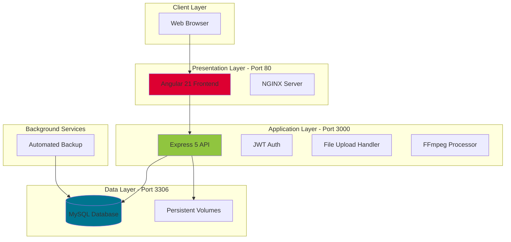
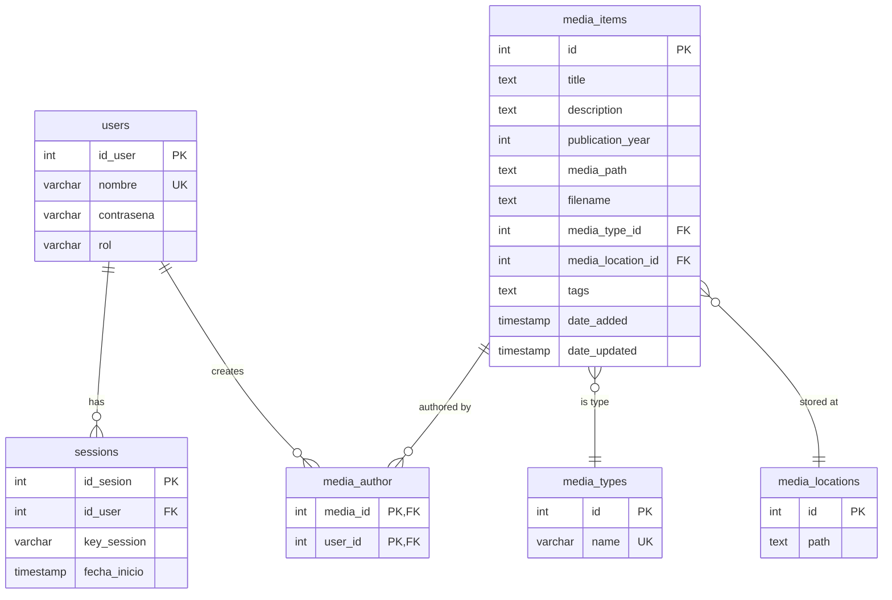
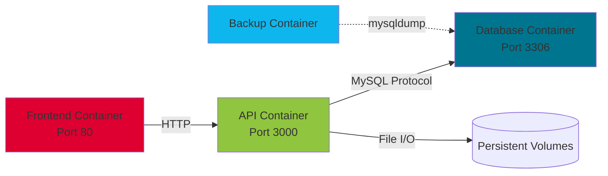
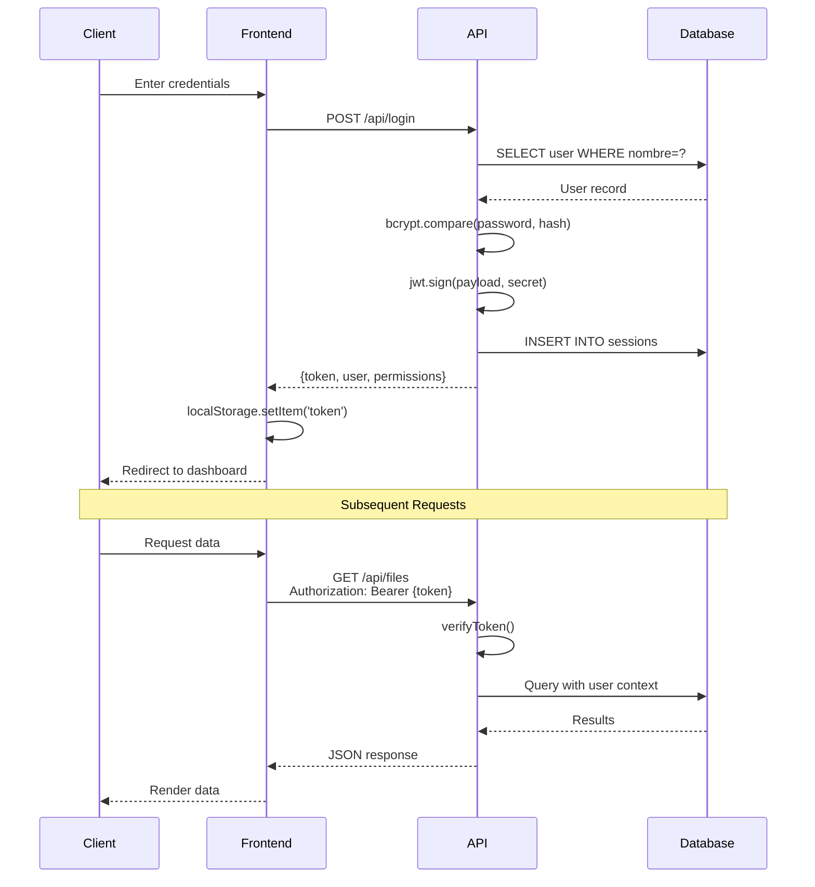

## System Overview

Televisión Écija Media Manager follows a classic three-tier architecture, fully containerized with Docker for production deployment.



## Technology Stack

<CardGroup cols={3}>
  <Card title="Angular 21" icon="angular">
    Modern TypeScript frontend with standalone components and signals
  </Card>
  <Card title="Express 5" icon="node">
    Node.js REST API with async/await patterns
  </Card>
  <Card title="MySQL 8" icon="database">
    Relational database with foreign key constraints
  </Card>
  <Card title="Docker Compose" icon="docker">
    Multi-container orchestration with persistent volumes
  </Card>
  <Card title="FFmpeg" icon="film">
    Video processing for thumbnail generation
  </Card>
  <Card title="JWT" icon="shield-halved">
    Stateless authentication tokens
  </Card>
</CardGroup>

## Frontend Architecture

### Angular 21 with Modern Patterns

The frontend uses Angular's latest features:

```typescript
// From: front/src/app/app.config.ts - Application configuration
import { ApplicationConfig } from '@angular/core';
import { provideRouter } from '@angular/router';
import { provideHttpClient, withInterceptors } from '@angular/common/http';
import { authInterceptor } from './interceptors/auth.interceptor';

export const appConfig: ApplicationConfig = {
  providers: [
    provideRouter(routes),
    provideHttpClient(
      withInterceptors([authInterceptor])
    )
  ]
};
```

### Component Structure

```typescript
// From: front/src/app/index/index.ts:14-27
@Component({
    selector: 'index-page',
    standalone: true,
    imports: [
        Header,
        FileGridComponent,
        FormsModule,
        CommonModule,
        HttpClientModule
    ],
    templateUrl: './page.html',
    styleUrls: ['./style.css']
})
export class IndexPage implements OnInit, OnDestroy {
    // Component logic
}
```

<Info>
  **Standalone Components**: The app uses Angular's standalone component API, eliminating the need for NgModules and reducing boilerplate.
</Info>

### Routing & Guards

```typescript
// From: front/src/app/app.routes.ts:10-33
export const routes: Routes = [
    {
        path: '',
        component: IndexPage,
        canActivate: [authGuard]
    },
    {
        path: 'dashboard',
        component: DashboardPage,
        canActivate: [authGuard, roleGuard(['admin'])]
    },
    {
        path: 'login',
        component: LoginPage
    }, 
    { 
        path: 'register', 
        component: RegisterComponent    
    },   
    { 
        path: '**', redirectTo: '/' 
    }
];
```

### Service Layer

**Authentication Service** (front/src/services/auth.service.ts:1-246):
- JWT token management
- User session handling
- Permission checking
- Role-based access control

**File Service** (front/src/services/file.service.ts:1-252):
- Media CRUD operations
- Statistics retrieval
- File uploads with FormData
- Thumbnail URL generation

**Local Storage Service** (front/src/services/localStorage.service.ts):
- Persistent user session data
- Token storage and retrieval

### HTTP Interceptors

```typescript
// From: front/src/app/interceptors/auth.interceptor.ts
// Automatically attaches JWT token to all API requests
export const authInterceptor: HttpInterceptorFn = (req, next) => {
    const token = localStorage.getItem('token');
    
    if (token) {
        const cloned = req.clone({
            headers: req.headers.set('Authorization', `Bearer ${token}`)
        });
        return next(cloned);
    }
    
    return next(req);
};
```

## Backend Architecture

### Express API Structure

```javascript
// From: api/main.js:1-17
require('dotenv').config();

const { execFile } = require("child_process");
const cors = require('cors')
const jwt = require('jsonwebtoken');
const bcrypt = require('bcryptjs');
const express = require('express')
const mysql = require('mysql2')
const multer = require('multer')
const fs = require('fs')
const path = require('path')
const ffmpegPath = require("ffmpeg-static");
const mime = require('mime-types');

const app = express()
app.use(express.json());
app.use(cors({ /* config */ }));
```

### Database Connection Pool

```javascript
// From: api/main.js:33-42
const { HOST: host, USER: user, PASSWORD: password, DATABASE: database, SECRET_KEY: secret, MEDIA_PATH: mediaPath } = process.env;

const connection = mysql.createPool({
    host,
    user,
    password,
    database,
    waitForConnections: true,
    connectionLimit: 10,
    queueLimit: 0
});
```

<Warning>
  **Connection Pooling**: The API uses a connection pool (limit: 10) to handle concurrent requests efficiently. Adjust `connectionLimit` based on expected load.
</Warning>

### Middleware Stack

**JWT Verification Middleware**:

```javascript
// From: api/main.js:44-55
function verifyToken(req, res, next) {
    const token = req.headers.authorization?.split(" ")[1];

    if (!token) return res.status(401).json({ error: "Token requerido" });

    jwt.verify(token, secret, (err, decoded) => {
        if (err) return res.status(403).json({ error: "Token inválido" });

        req.user = decoded;
        next();
    });
}
```

**File Upload Middleware**:

```javascript
// From: api/main.js:57-70
const storage = multer.diskStorage({
    destination: function (req, file, cb) {
        const basePath = mediaPath || path.join(__dirname, "media");
        const dir = path.join(basePath);
        if (!fs.existsSync(dir)) fs.mkdirSync(dir, { recursive: true });
        cb(null, dir);
    },
    filename: function (req, file, cb) {
        const uniqueName = Date.now() + "_" + file.originalname;
        cb(null, uniqueName);
    }
});
const upload = multer({ storage });
```

### API Endpoints

<Accordion title="Authentication Endpoints">
  ```javascript
  POST /api/login       // User login with JWT generation
  POST /api/register    // New user registration
  POST /api/logout      // Session termination
  GET  /api/user/role   // Current user permissions
  ```

  **Example Login Flow**:
  ```javascript
  // From: api/main.js:72-103
  app.post('/api/login', async (req, res) => {
      const data = req.body;

      if (!data) return res.status(401).json({ error: "Necesidad de credenciales" });
      
      connection.promise().query(`SELECT * FROM users WHERE nombre = ?`, [data.username])
          .then(async ([rows]) => {
              if (rows.length === 0)
                  return res.status(401).json({ error: "Usuario incorrecto" });
              
              const user = rows[0];
              const valid = await bcrypt.compare(data.password, user.contrasena);

              if (!valid)
                  return res.status(401).json({ error: "Contraseña incorrecta" });

              const token = jwt.sign(
                  { id_user: user.id_user, nombre: user.nombre, rol: user.rol },
                  secret,
                  { expiresIn: "7d" }
              );

              await connection.promise().query(
                  `INSERT INTO sessions (id_user, key_session) VALUES (?, ?)`,
                  [user.id_user, token]
              );

              delete user.contrasena;
              res.json({ ...user, token, success: true });
          })
          .catch(err => res.status(500).json({ error: err.message }))
  });
  ```
</Accordion>

<Accordion title="Media Management Endpoints">
  ```javascript
  POST   /api/upload-content       // Upload new media file
  GET    /api/files                // List all files with filters
  GET    /api/files/paginated      // Paginated file listing
  GET    /api/files/:id            // Get specific file details
  PUT    /api/files/:id            // Update file metadata
  DELETE /api/files/:id            // Delete file
  GET    /api/files/:id/download   // Download file
  GET    /api/files/:id/thumbnail  // Get/generate video thumbnail
  ```

  **Complex Upload Logic**:
  ```javascript
  // From: api/main.js:169-257
  app.post('/api/upload-content', verifyToken, upload.single("file"), async (req, res) => {
      if (req.user.rol === "viewer")
          return res.status(403).json({ error: "No tienes permisos para subir contenido" });

      try {
          const {
              title, description, publication_year,
              media_type_id, media_location_id,
              tags, author_ids
          } = req.body;

          const file = req.file;
          if (!file) return res.status(400).json({ error: "Archivo requerido" });

          // Get storage location path
          let [basePaths] = await connection.promise().query(
              "SELECT path FROM media_locations WHERE id = ?",
              [media_location_id]
          );

          if (!fs.existsSync(basePaths[0].path))
              fs.mkdirSync(basePaths[0].path, { recursive: true });

          const filename = Date.now() + "_" + file.originalname;
          const fullPath = path.join(basePaths[0].path, filename);

          // Insert media record
          const [result] = await connection.promise().query(`
              INSERT INTO media_items 
              (title, description, publication_year, media_path, filename, media_type_id, media_location_id, tags)
              VALUES (?, ?, ?, ?, ?, ?, ?, ?)
          `, [title, description, publication_year || null, fullPath, filename, media_type_id, media_location_id, tags || null]);

          const mediaId = result.insertId;

          // Insert author relationships
          if (author_ids) {
              const authorIdsArray = Array.isArray(author_ids) ? author_ids : JSON.parse(author_ids);
              for (const authorId of authorIdsArray) {
                  await connection.promise().query(
                      "INSERT INTO media_author (media_id, user_id) VALUES (?, ?)",
                      [mediaId, authorId]
                  );
              }
          }

          // Move uploaded file to final location
          await fs.rename(req.file.path, fullPath, () => {
              res.json({ success: true, id: mediaId, path: fullPath });
          });
      } catch (err) {
          res.status(500).json({ success: false, error: err.message });
      }
  });
  ```
</Accordion>

<Accordion title="Administrative Endpoints">
  ```javascript
  GET    /api/stats            // System statistics
  GET    /api/users            // List all users (admin only)
  POST   /api/users            // Create new user (admin only)
  PUT    /api/users/:id        // Update user (admin only)
  DELETE /api/users/:id        // Delete user (admin only)
  GET    /api/media-type       // List media types
  POST   /api/media-type       // Create media type
  GET    /api/locations        // List storage locations
  POST   /api/locations        // Create location
  PUT    /api/locations/:id    // Update location
  DELETE /api/locations/:id    // Delete location
  ```
</Accordion>

## Database Architecture

### Schema Design

```sql
-- From: db/init.sql:1-68
DROP DATABASE IF EXISTS administradorMultimedia;
CREATE DATABASE administradorMultimedia;
USE administradorMultimedia;

CREATE TABLE users (
    id_user INT AUTO_INCREMENT PRIMARY KEY,
    nombre VARCHAR(50) UNIQUE,
    contrasena VARCHAR(255),
    CHECK (CHAR_LENGTH(contrasena) >= 4),
    rol VARCHAR(30) DEFAULT "viewer",
    CHECK (rol IN ("admin", "moderator", "viewer"))
);

CREATE TABLE sessions (
    id_sesion INT AUTO_INCREMENT PRIMARY KEY,
    id_user INT,
    key_session VARCHAR(512),
    fecha_inicio TIMESTAMP DEFAULT CURRENT_TIMESTAMP,
    FOREIGN KEY (id_user) REFERENCES users(id_user) ON DELETE CASCADE
);

CREATE TABLE media_types (
    id INT AUTO_INCREMENT PRIMARY KEY,
    name VARCHAR(512) UNIQUE
);

CREATE TABLE media_locations (
    id INT AUTO_INCREMENT PRIMARY KEY,
    path TEXT
);

CREATE TABLE media_items (
    id INT AUTO_INCREMENT PRIMARY KEY,
    title TEXT,
    description TEXT,
    publication_year INT,
    media_path TEXT,
    filename TEXT,
    media_type_id INT,
    media_location_id INT,
    tags TEXT,
    date_added TIMESTAMP DEFAULT CURRENT_TIMESTAMP,
    date_updated TIMESTAMP DEFAULT CURRENT_TIMESTAMP ON UPDATE CURRENT_TIMESTAMP,
    FOREIGN KEY (media_location_id) REFERENCES media_locations(id) ON DELETE CASCADE,
    FOREIGN KEY (media_type_id) REFERENCES media_types(id) ON DELETE SET NULL
);

CREATE TABLE media_author (
    media_id INT,
    user_id INT,
    PRIMARY KEY (media_id, user_id),
    FOREIGN KEY (media_id) REFERENCES media_items(id) ON DELETE CASCADE,
    FOREIGN KEY (user_id) REFERENCES users(id_user) ON DELETE CASCADE
);
```

### Entity Relationship Diagram



### Default Data

```sql
-- From: db/init.sql:56-68
INSERT INTO users (nombre, contrasena, rol) 
VALUES (
    "admin", 
    "$2b$12$vbj7TFESQuAcFTBXgacpuu7GGewrfmuOVN8vxQxE2DIaoqSHFi69e", 
    "admin"
);
INSERT INTO users (nombre, contrasena, rol) 
VALUES (
    "viewer", 
    "$2a$12$RCCN9wh0S27yBoUkYaUb4us6m9J8IO6UC/rtpeKLlxXPJ/luoJZE6", 
    "viewer"
);
```

<Note>
  **Default Credentials**:
  - Admin: `admin` / `admin1234` (bcrypt hashed)
  - Viewer: `viewer` / `viewer1234` (bcrypt hashed)
</Note>

## Docker Architecture

### Multi-Container Setup

```yaml
# From: docker-compose.yml:1-96
services:
  database:
    build:
      context: ./db
      dockerfile: Dockerfile
    container_name: file_manager_mysql
    restart: unless-stopped
    environment:
      MYSQL_ROOT_PASSWORD: root
      MYSQL_DATABASE: administradorMultimedia
      MYSQL_USER: user
      MYSQL_PASSWORD: root
    ports:
      - "3306:3306"
    volumes:
      - mysql_data:/var/lib/mysql
      - ./db/backups:/backups
    networks:
      - file_manager_network

  api:
    build:
      context: ./api
      dockerfile: Dockerfile
    container_name: file_manager_api
    restart: unless-stopped
    environment:
      NODE_ENV: production
      PORT: 3000
      HOST: database
      USER: root
      PASSWORD: root
      DATABASE: administradorMultimedia
      SECRET_KEY: claveSecretaNoMandarANadie
      MEDIA_PATH: /usr/src/app/uploads
    ports:
      - "3000:3000"
    volumes:
      - uploads_data:/usr/src/app/uploads
      - api_logs:/usr/src/app/logs
    depends_on:
      - database
    networks:
      - file_manager_network

  frontend:
    build:
      context: ./front
      dockerfile: Dockerfile
    container_name: file_manager_frontend
    restart: unless-stopped
    ports:
      - "80:80"
    depends_on:
      - api
    networks:
      - file_manager_network

  db_backup:
    image: alpine:latest
    container_name: file_manager_backup
    restart: unless-stopped
    volumes:
      - mysql_data:/backup/mysql:ro
      - ./db/backups:/backups
    entrypoint: |
      sh -c "
      apk add --no-cache mysql-client
      while true; do
        mysqldump -h database -u root -proot administradorMultimedia > /backups/backup_\$(date +%Y%m%d_%H%M%S).sql 2>/backups/error.log || echo 'Error en backup' > /backups/backup_error.log
        ls -tp /backups/*.sql 2>/dev/null | tail -n +8 | xargs -I {} rm -- {} 2>/dev/null
        sleep 86400
      done
      "
    depends_on:
      - database
    networks:
      - file_manager_network

volumes:
  mysql_data:
    name: file_manager_mysql_data
  uploads_data:
    name: file_manager_uploads_data
  api_logs:
    name: file_manager_api_logs

networks:
  file_manager_network:
    name: file_manager_network
    driver: bridge
```

### Persistent Volumes

<CardGroup cols={3}>
  <Card title="mysql_data">
    Database files persist across container restarts
  </Card>
  <Card title="uploads_data">
    Uploaded media files stored outside containers
  </Card>
  <Card title="api_logs">
    Application logs for debugging and monitoring
  </Card>
</CardGroup>

### Container Communication



<Info>
  All containers communicate via the `file_manager_network` bridge network, allowing services to reference each other by container name (e.g., `http://api:3000`).
</Info>

## Security Architecture

### Authentication Flow



### Password Security

```javascript
// From: api/main.js:82-85
const user = rows[0];
const valid = await bcrypt.compare(data.password, user.contrasena);

if (!valid)
    return res.status(401).json({ error: "Contraseña incorrecta" });
```

**Bcrypt hashing** with salt rounds:
```javascript
// From: api/main.js:121
const hashedPassword = await bcrypt.hash(data.password, 10);
```

### CORS Configuration

```javascript
// From: api/main.js:21-27
app.use(cors({
    origin: '*',
    methods: ['GET', 'POST', 'PUT', 'DELETE', 'OPTIONS'],
    allowedHeaders: ['Content-Type', 'Authorization', 'Origin', 'X-Requested-With', 'Accept'],
    credentials: true,
    optionsSuccessStatus: 200
}));
```

<Warning>
  **Production Security**: The current CORS configuration allows all origins (`origin: '*'`). In production, restrict this to your specific domain(s).
</Warning>

## Deployment Architecture

### Environment Variables

**API Environment** (docker-compose.yml:27-35):
```bash
NODE_ENV=production
PORT=3000
HOST=database
USER=root
PASSWORD=root
DATABASE=administradorMultimedia
SECRET_KEY=claveSecretaNoMandarANadie
MEDIA_PATH=/usr/src/app/uploads
```

**Database Environment** (docker-compose.yml:8-12):
```bash
MYSQL_ROOT_PASSWORD=root
MYSQL_DATABASE=administradorMultimedia
MYSQL_USER=user
MYSQL_PASSWORD=root
```

### Port Mapping

| Service | Internal Port | External Port | Purpose |
|---------|--------------|---------------|----------|
| Frontend | 80 | 80 | Web UI access |
| API | 3000 | 3000 | REST endpoints |
| Database | 3306 | 3306 | MySQL connections |

### Deployment Scripts

```bash
# From: utils/deploy.sh
#!/bin/bash
# Automated deployment script

echo "Building and deploying containers..."
docker-compose down
docker-compose build --no-cache
docker-compose up -d

echo "Waiting for services to start..."
sleep 10

echo "Checking service health..."
docker-compose ps

echo "Deployment complete!"
```

## Performance Considerations

### Database Optimization

<CardGroup cols={2}>
  <Card title="Connection Pooling">
    10 concurrent connections reused across requests
  </Card>
  <Card title="Indexed Queries">
    Primary and foreign keys automatically indexed
  </Card>
  <Card title="Query Optimization">
    GROUP BY used efficiently with DISTINCT aggregations
  </Card>
  <Card title="LIMIT/OFFSET">
    Pagination prevents loading entire datasets
  </Card>
</CardGroup>

### File Storage Strategy

```javascript
// From: api/main.js:191-200
let [basePaths] = await connection.promise().query(
    "SELECT path FROM media_locations WHERE id = ?",
    [media_location_id]
);

if (!fs.existsSync(basePaths[0].path))
    fs.mkdirSync(basePaths[0].path, { recursive: true });

const filename = Date.now() + "_" + file.originalname;
const fullPath = path.join(basePaths[0].path, filename);
```

- **Timestamped filenames** prevent collisions
- **Path separation** allows distributed storage
- **Lazy thumbnail generation** reduces initial upload time

### Frontend Optimization

```typescript
// From: front/src/app/index/index.ts:68-102
private loadInitialData() {
    this.isLoading = true;

    forkJoin({
        stats: this.fileService.getStats(),
        types: this.fileService.getContentTypes()
    }).pipe(
        finalize(() => {
            this.isLoading = false;
            this.cdr.detectChanges();
        }),
        takeUntil(this.destroy$)
    ).subscribe({
        next: (results) => {
            // Process results
        }
    });
}
```

- **Parallel requests** with `forkJoin`
- **Change detection optimization** with `ChangeDetectorRef`
- **Memory leak prevention** with `takeUntil(destroy$)`

## Monitoring & Maintenance

### Log Management

```yaml
# From: docker-compose.yml:42
volumes:
  - api_logs:/usr/src/app/logs
```

Application logs persist in the `api_logs` volume for troubleshooting.

### Backup Verification

```bash
# Check backup files
ls -lh db/backups/

# Verify latest backup
mysql -u root -p administradorMultimedia < db/backups/backup_YYYYMMDD_HHMMSS.sql
```

### Health Checks

```bash
# Check running containers
docker-compose ps

# View service logs
docker-compose logs -f api
docker-compose logs -f database
docker-compose logs -f db_backup

# Monitor resource usage
docker stats
```

## Scalability Considerations

<Accordion title="Horizontal Scaling">
  **API Layer**: Multiple API containers can run behind a load balancer
  
  ```yaml
  api:
    deploy:
      replicas: 3
  ```
  
  Requires session storage migration from MySQL to Redis for shared state.
</Accordion>

<Accordion title="Database Scaling">
  **Read Replicas**: MySQL replication for read-heavy workloads
  
  **Connection Pool Tuning**: Adjust based on replica count
  
  ```javascript
  const connection = mysql.createPool({
      connectionLimit: 20, // Increase for more API instances
      // ...
  });
  ```
</Accordion>

<Accordion title="Storage Scaling">
  **Distributed File Systems**: Replace local volumes with:
  - NFS for network-attached storage
  - S3-compatible object storage
  - GlusterFS for distributed file system
  
  Update `MEDIA_PATH` environment variable to point to shared storage.
</Accordion>

## Technology Versions

```json
// Frontend Dependencies (front/package.json)
{
  "dependencies": {
    "@angular/common": "^21.1.0",
    "@angular/core": "^21.1.0",
    "@angular/router": "^21.1.0"
  }
}
```

```json
// Backend Dependencies (api/package.json)
{
  "dependencies": {
    "express": "^5.2.1",
    "mysql2": "^3.17.1",
    "bcryptjs": "^3.0.3",
    "jsonwebtoken": "^9.0.3",
    "multer": "^2.0.2",
    "ffmpeg-static": "^5.3.0"
  }
}
```

## Next Steps

<Card title="Return to Introduction" icon="home" href="/introduction">
  Review the project overview and key capabilities
</Card>